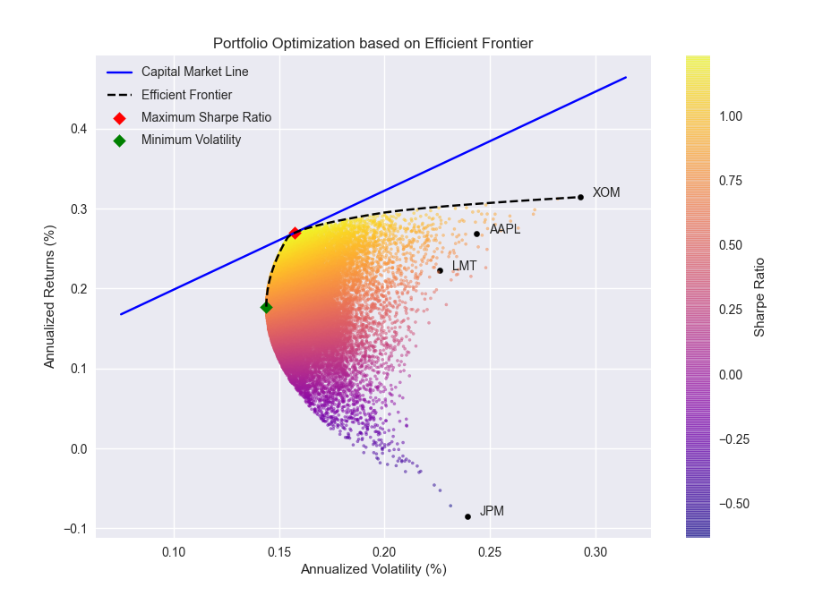

# Markowitz Efficient Frontier

A command-line tool to find the optimal portfolio composition employing Markowitz Efficient Frontier Theory

## Installation

- Python version 3.6 or greater is required.
- Install the requirements using

```bash
$ pip3 install -r requirements.txt
```

## Documentation

```
❯ python3 efficientFrontier.py --help
usage: efficientFrontier.py [-h] [--stocks [STOCKS [STOCKS ...]]] [--num NUM] [--rfr RFR] [--years YEARS]

optional arguments:
  -h, --help            show this help message and exit
  --stocks [STOCKS [STOCKS ...]]
                        The stocks to include in portfolio
  --num NUM             The number of portfolios to be simulated
  --rfr RFR             The risk free rate of return
  --years YEARS         The number of years
```

## Sample Execution

```
❯ python3 efficientFrontier.py --stocks AAPL JPM XOM LMT
Stocks:  ['AAPL', 'JPM', 'XOM', 'LMT']
Risk Free Rate:  0.075
--------------------------------------------------------------------------------
Maximum Sharpe Ratio Portfolio Allocation

Annualised Return: 0.27
Annualised Volatility: 0.16
Symbols      AAPL  JPM    XOM    LMT
Allocation  39.88  0.0  31.14  28.99
--------------------------------------------------------------------------------
Minimum Volatility Portfolio Allocation

Annualised Return: 0.18
Annualised Volatility: 0.14
Symbols      AAPL    JPM    XOM    LMT
Allocation  27.17  22.86  13.34  36.64
Individual Stock Returns and Volatility

AAPL : Annualized Return =  26.86 , Annualized Volatility =  24.38
JPM : Annualized Return =  -8.43 , Annualized Volatility =  23.94
XOM : Annualized Return =  31.45 , Annualized Volatility =  29.31
LMT : Annualized Return =  22.29 , Annualized Volatility =  22.62
--------------------------------------------------------------------------------
```

